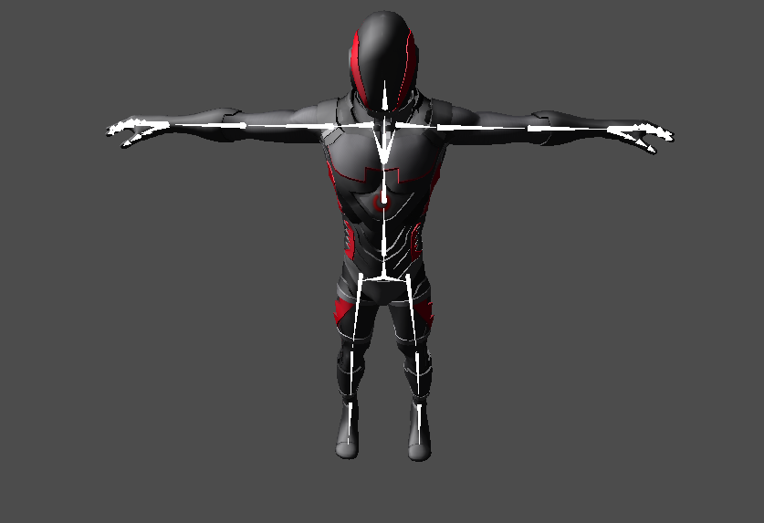
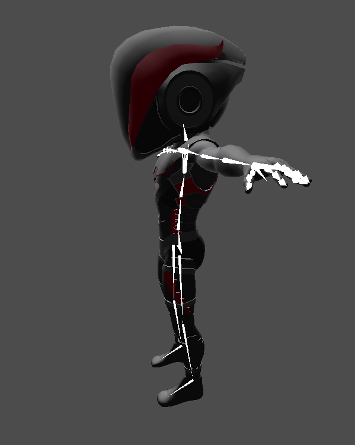

# Курс анимации 

Курс посвещён основам анимации в видеоиграх. В данном репозитории:

- Визуализация рига персонажа:

- Скиннинг с привязкой к костям:

- Проигрывание анимаций:

- Дерево смешивания 1D:

